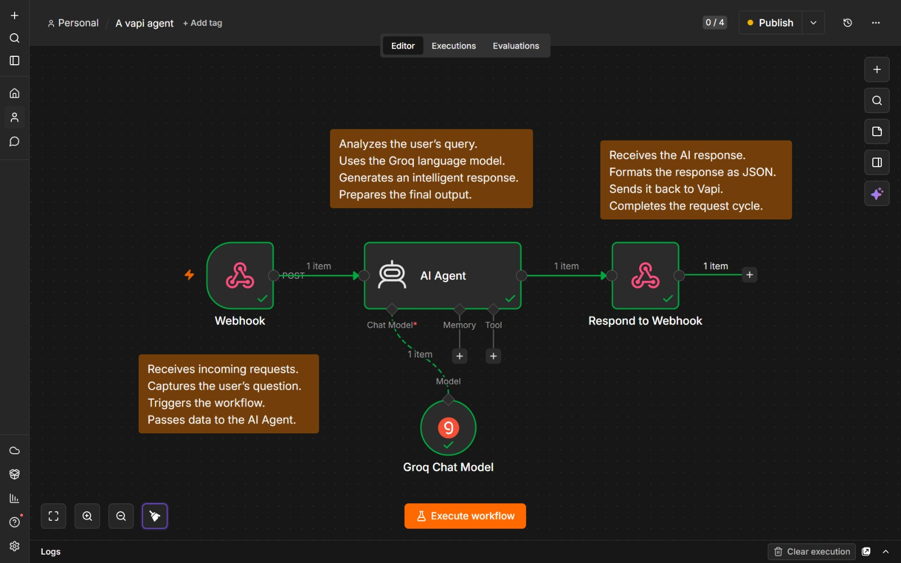
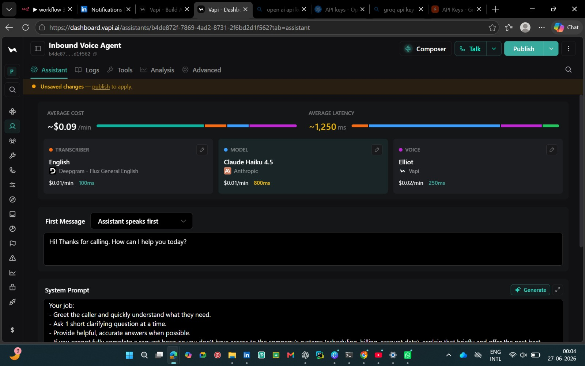
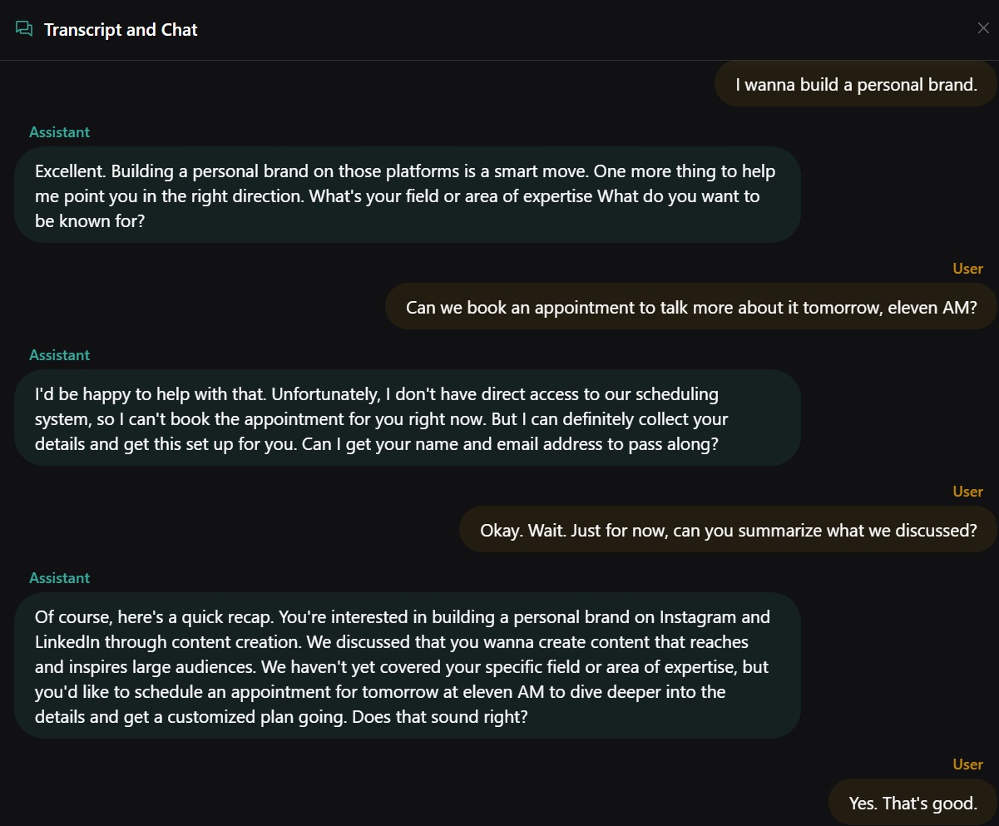

# 🎙️ AI Voice Agent

An AI-powered business voice assistant built using **Vapi**, **n8n**, and **Groq**. This project demonstrates how voice conversations can be processed through AI agent workflows to generate intelligent, context-aware responses.

---

## 🚀 Features

- 🎙️ AI-powered voice conversations
- 💬 Multi-turn contextual conversations
- 📅 Appointment scheduling workflow
- 📝 Conversation summarization
- 📧 Lead information collection
- ⚡ Groq LLM integration
- 🔗 n8n workflow automation
- 🌐 Webhook-based API integration
- 📞 Business customer support automation

---

## 🛠️ Tech Stack

- Vapi
- n8n
- Groq
- Webhooks

---

## 📂 Project Structure

```
AI-Voice-Agent
│
├── docs
├── n8n
├── README.md
└── LICENSE
```

## 📂 Repository Structure

- 📁 [docs](https://github.com/palak-singh-20/AI-Voice-Agent/tree/main/docs) – Screenshots and images
- 📁 [n8n](https://github.com/palak-singh-20/AI-Voice-Agent/tree/main/n8n) – Exported workflow
- 📄 [workflow.json](https://github.com/palak-singh-20/AI-Voice-Agent/blob/main/n8n/workflow.json)
- 📄 [LICENSE](https://github.com/palak-singh-20/AI-Voice-Agent/blob/main/LICENSE)

---

## 🏗️ Workflow

```
User Voice
    │
    ▼
Vapi
    │
    ▼
Webhook
    │
    ▼
n8n AI Agent
    │
    ▼
Groq LLM
    │
    ▼
Webhook Response
    │
    ▼
Vapi Voice Response
```

---

## 📸 Screenshots

### n8n Workflow

[](https://github.com/palak-singh-20/AI-Voice-Agent/blob/main/docs/architecture.jpeg)

### Vapi Configuration

[](https://github.com/palak-singh-20/AI-Voice-Agent/blob/main/docs/vapi-config.jpeg)

### Conversation Example

[](https://github.com/palak-singh-20/AI-Voice-Agent/blob/main/docs/transcript.jpeg)

---

## 🔮 Future Improvements

- Google Calendar integration
- RAG (Retrieval-Augmented Generation)
- CRM integration
- Email automation
- Multi-language support
- Function calling
- Database integration

---

## 👨‍💻 Author

**Palak**

GitHub: https://github.com/palak-singh-20

---

## ⭐ If you found this project useful, consider giving it a star!
